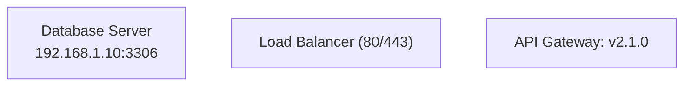
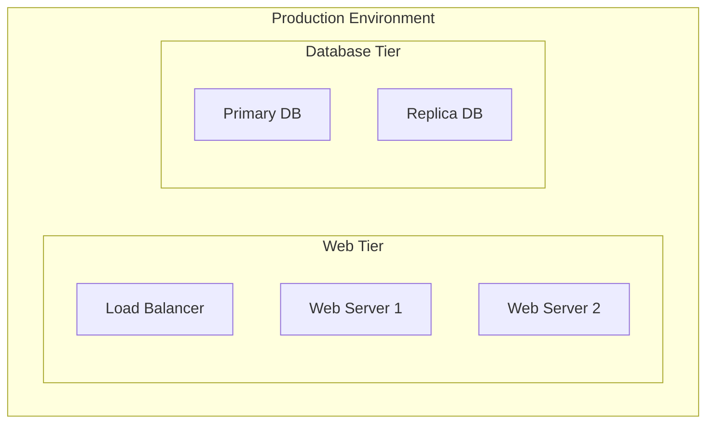
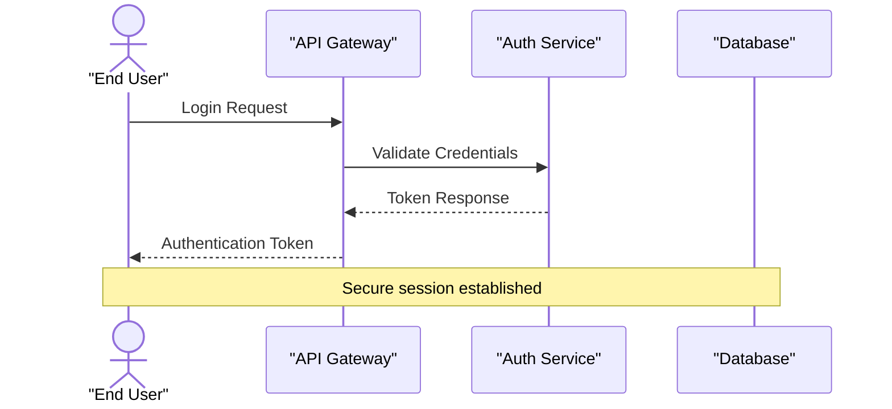
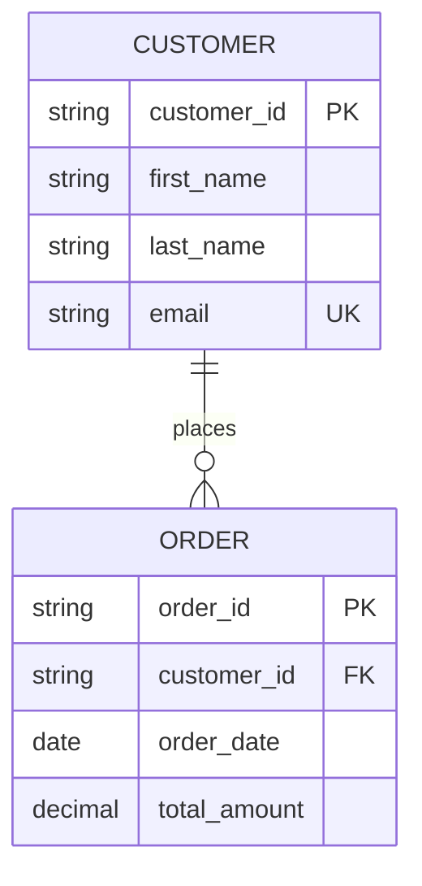
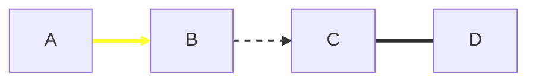
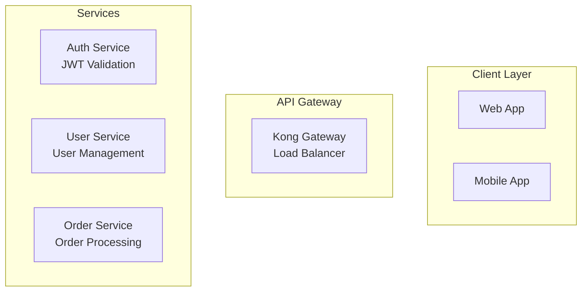

# Mermaid Diagrams - Visual Brainstorming Skill

## Purpose
Expert-level guidance for creating precise, effective Mermaid diagrams that communicate complex information clearly through visual representation.

## Core Principles

**Visual Communication Excellence:**
- Transform abstract concepts into concrete visual representations
- Use appropriate diagram types for specific communication goals
- Maintain consistency in style and notation throughout projects
- Balance detail with clarity to avoid overwhelming the viewer

**Syntax Precision & Best Practices:**
- Strict adherence to Mermaid syntax requirements prevents rendering failures
- Proper node labelling with quoted strings for special characters
- Strategic use of subgraphs, styling, and layout controls
- Error prevention through understanding of common syntax pitfalls

## Critical Syntax Requirements

### Universal Quoting Rules
**ALWAYS wrap node labels in double quotes when they contain:**
- Special characters: `:` `/` `@` `#` `%` `&` `*` `+` `=` `?` `^` `|`
- HTML tags or line breaks: `<br/>` `<i>` `<b>`
- Network notation: IP addresses, port numbers, CIDR blocks
- Technical specifications: ratios, measurements, timestamps
- Multiple words with spaces

**Correct Examples:**


**Incorrect (Will Fail):**
```
A[Database Server<br/>192.168.1.10:3306]
B[Load Balancer (80/443)]
C[API Gateway: v2.1.0]
```

### Reserved Word Handling
**Critical Reserved Words:**
- `end` - Must be capitalised or quoted: `"end"` or `End` or `END`
- `o` at start of connection - Add space: `A--- ops` not `A---ops`
- `x` at start of connection - Add space: `A--- xray` not `A---xray`

### Direction and Layout Control
**Flowchart Orientations:**
- `TD` or `TB` - Top to bottom (default)
- `BT` - Bottom to top
- `LR` - Left to right
- `RL` - Right to left

**Subgraph Organisation:**


## Diagram Type Selection Matrix

### Flowcharts / Graph Diagrams
**Use For:**
- Process workflows and decision trees
- System architecture and network topology
- Organisational structures and hierarchies
- Algorithm flowcharts and logic flows

**Key Features:**
- Multiple node shapes for different purposes
- Flexible connection types: `-->` `-.->` `==>`
- Subgraph support for logical grouping
- Comprehensive styling and theming options

### Sequence Diagrams
**Use For:**
- API call sequences and protocol exchanges
- User interaction flows and system handoffs
- Temporal relationships and message passing
- Authentication and authorisation flows

**Syntax Structure:**


### Class Diagrams
**Use For:**
- Object-oriented design documentation
- Database schema representation
- Component relationships and dependencies
- Interface and inheritance structures

**Relationship Types:**
- `-->` - Association
- `*--` - Composition
- `o--` - Aggregation  
- `--|>` - Inheritance
- `..>` - Implementation

### Entity Relationship Diagrams
**Use For:**
- Database design and documentation
- Data model visualisation
- Relationship cardinality representation
- Schema migration planning

**Relationship Syntax:**


### State Diagrams
**Use For:**
- System state machines and transitions
- Workflow status tracking
- Application lifecycle management
- Process state visualisation

**State Syntax:**
- `[*] -->` - Initial state
- `--> [*]` - Final state
- `state --> state2 : Event/Action`

### Timeline Diagrams
**Use For:**
- Project planning and milestones
- Historical event documentation
- Process timeline visualisation
- Release planning and roadmaps

### Gantt Charts
**Use For:**
- Project scheduling and dependencies
- Resource allocation planning
- Task timeline management
- Critical path visualisation

### Pie and Chart Diagrams
**Use For:**
- Statistical data representation
- Budget allocation visualisation
- Performance metrics display
- Comparative analysis

## Advanced Techniques

### Styling and Theming
**Custom Node Styling:**
```mermaid
flowchart TD
    A["Critical System"]
    B["Warning State"]
    C["Normal Operation"]
    
    classDef critical fill:#ff6b6b,stroke:#c92a2a,stroke-width:3px
    classDef warning fill:#ffd93d,stroke:#fab005,stroke-width:2px
    classDef normal fill:#51cf66,stroke:#2e7b32,stroke-width:1px
    
    class A critical
    class B warning  
    class C normal
```

**Custom Link Styling:**


### Complex Data Representation
**Multi-dimensional Information:**
- Use subgraphs for logical domains
- Employ consistent colour coding across related diagrams
- Include metadata in node descriptions
- Link related diagrams through consistent naming

**Large System Architecture:**
- Break into multiple focused diagrams
- Use consistent component naming across diagrams
- Include legend/key for symbols and colours
- Maintain hierarchical abstraction levels

### Error Prevention Strategies

**Pre-Creation Validation:**
1. **Check Special Characters** - Scan all labels for special characters requiring quotes
2. **Verify Reserved Words** - Ensure `end`, `o`, `x` are properly handled
3. **Validate Node IDs** - Confirm unique, consistent node identifiers
4. **Test Syntax** - Use Mermaid validator before finalising diagrams

**Common Pitfall Avoidance:**
- Don't mix diagram types in single code block
- Avoid deeply nested subgraphs (max 3-4 levels)
- Limit node labels to readable lengths
- Ensure connection syntax matches diagram type

### Integration with Documentation

**Markdown Integration:**
```markdown
## System Architecture

The following diagram illustrates our microservices architecture:


```

**Multi-Diagram Documentation:**
- Use consistent naming conventions across diagrams
- Reference diagrams by clear section headings
- Include diagram purpose and scope in surrounding text
- Maintain diagram version control with documentation

## Brainstorming Applications

### Process Mapping Sessions
- Visual workflow identification
- Bottleneck and improvement opportunity discovery
- Stakeholder alignment on current and future states
- Decision point clarification and documentation

### System Design Brainstorming
- Architecture pattern exploration
- Component interaction mapping  
- Failure mode analysis through state diagrams
- Cross-functional requirement visualisation

### Strategic Planning Visualization
- Timeline-based roadmap creation
- Resource allocation and dependency mapping
- Risk assessment through decision trees
- Stakeholder relationship mapping

## Quality Assurance Checklist

**Before Publishing:**
- [ ] All special characters properly quoted
- [ ] Reserved words correctly handled
- [ ] Node IDs unique and consistent
- [ ] Appropriate diagram type selected
- [ ] Clear, descriptive node labels
- [ ] Logical subgraph organisation
- [ ] Consistent styling applied
- [ ] Diagram validates without errors
- [ ] Purpose clearly communicated
- [ ] Integration with surrounding documentation

**Accessibility Considerations:**
- Use descriptive labels rather than symbols alone
- Ensure sufficient colour contrast in custom styling
- Include text-based legend when using colour coding
- Provide alternative text description for complex diagrams

## Collaborative Diagramming

**Version Control Integration:**
- Track diagram changes alongside code changes
- Use meaningful commit messages for diagram updates
- Review diagram changes in pull requests
- Maintain diagram documentation standards

**Team Standards:**
- Establish consistent node naming conventions
- Define standard colour schemes for diagram types
- Create reusable subgraph templates
- Document custom styling guidelines

**Cross-functional Collaboration:**
- Use diagrams as communication bridge between technical and business teams
- Include stakeholder feedback in diagram iteration cycles
- Validate diagrams with subject matter experts
- Maintain living documentation through regular updates

This skill enables creation of professional-quality Mermaid diagrams that effectively communicate complex information while adhering to strict syntax requirements and maintaining visual excellence.