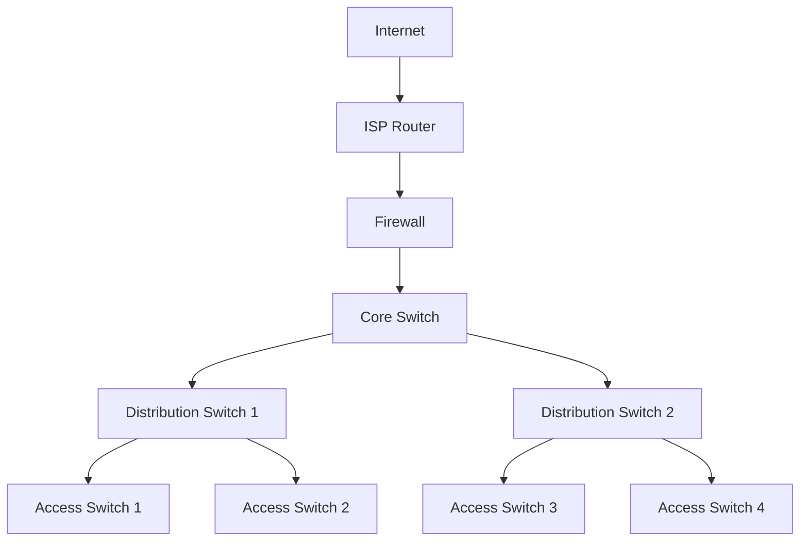
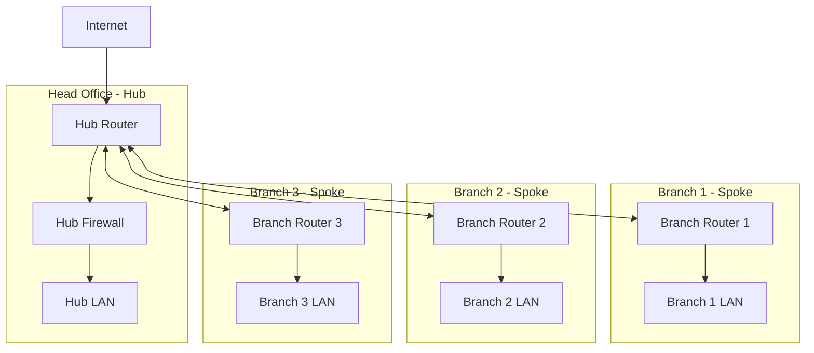
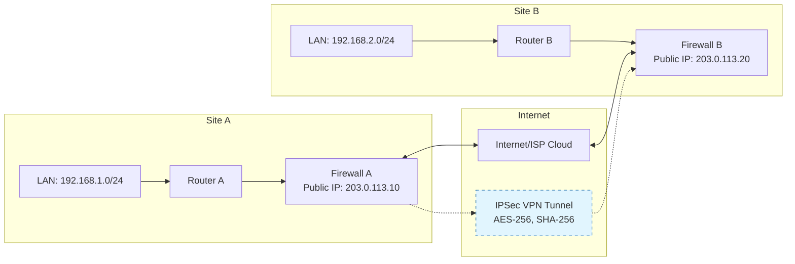
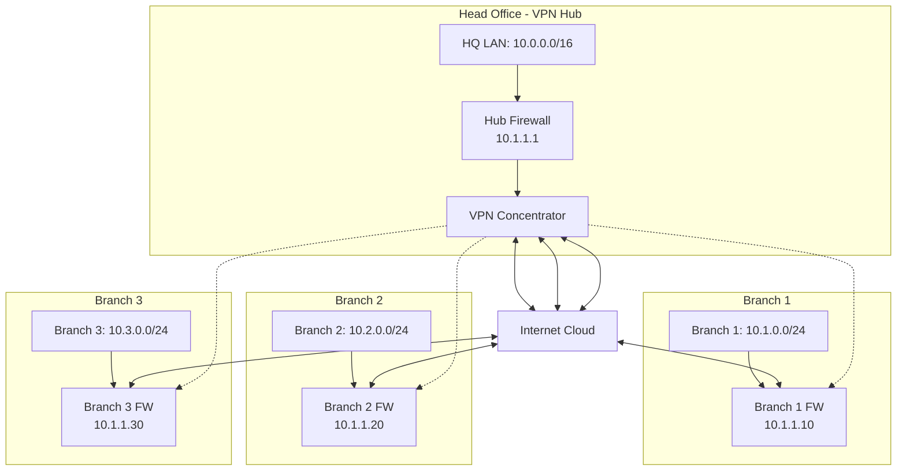
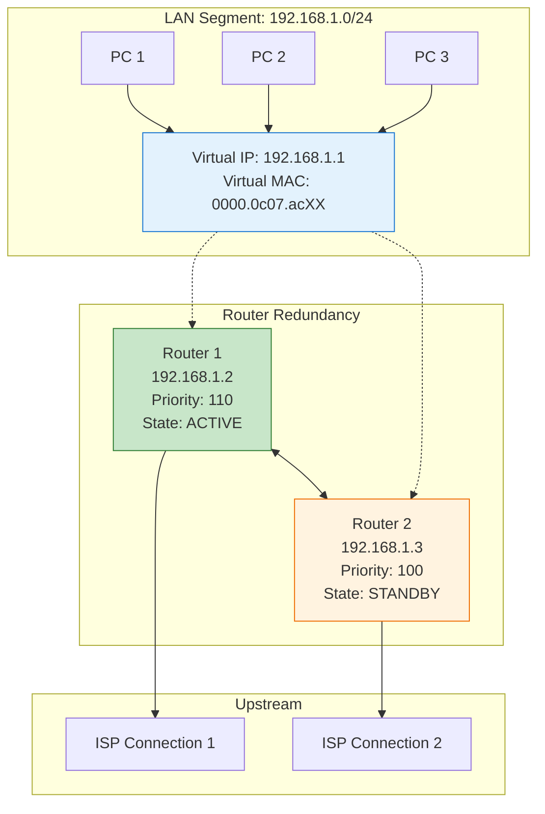
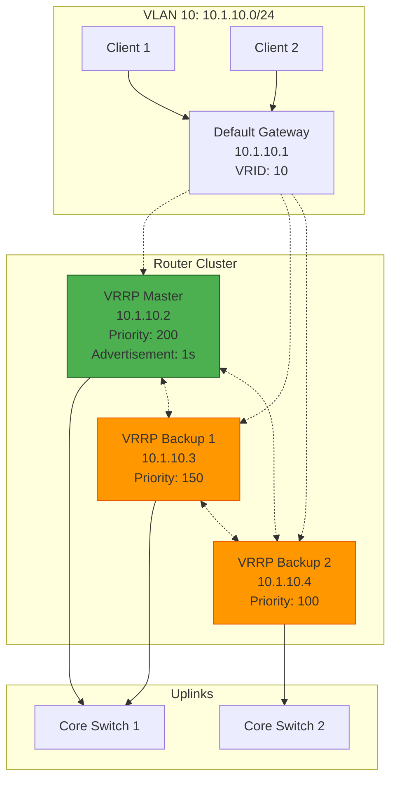
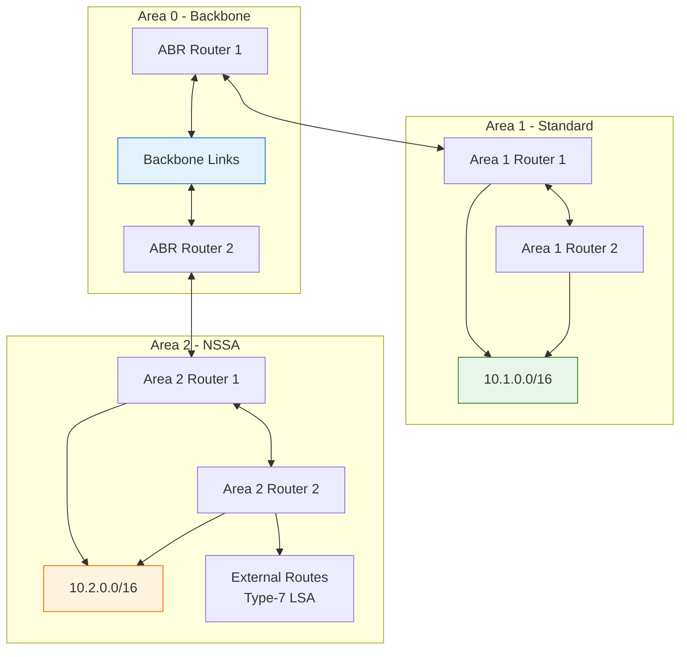
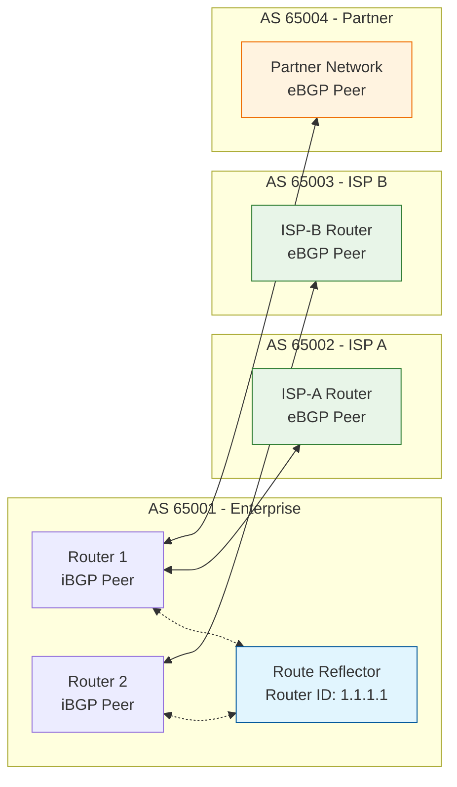
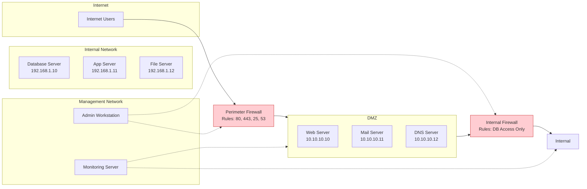
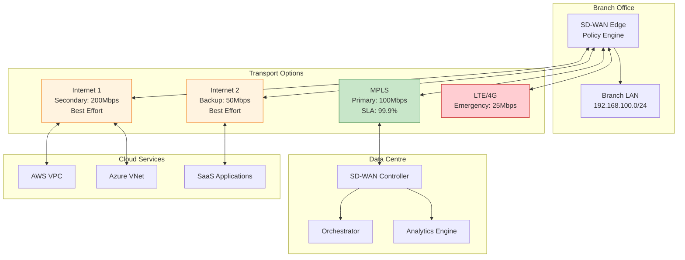

---
name: brainstorming-technical-networking
description: "Expert-level brainstorming for network architecture and design. Leverages CCNA and CCIE expertise for routing, switching, security, WAN design, and enterprise networking solutions through structured dialogue."
---

# Technical Networking Brainstorming

## Activation Triggers

This skill responds to network architecture and design brainstorming requests:

- "Brainstorm network design for [enterprise/campus/data centre]"
- "Help me brainstorm routing strategy for [WAN/LAN/multi-site]"
- "Let's brainstorm network security architecture for [environment]"
- "Brainstorm SD-WAN implementation for [organisation]"
- "Help me brainstorm network segmentation for [security requirements]"
- "Let's brainstorm wireless design for [campus/office]"
- "Brainstorm network redundancy for [critical systems]"
- "Help me brainstorm network troubleshooting approach for [issue]"
- "Let's brainstorm cloud networking strategy for [hybrid environment]"

## Scope

**What this covers:**
- Enterprise network architecture and design (campus, WAN, data centre)
- Routing protocols and strategies (OSPF, EIGRP, BGP, static routing)
- Switching technologies and VLANs, STP, port security, QoS
- Network security architecture (firewalls, VPNs, network segmentation, zero trust)
- Wireless networking design (enterprise WiFi, coverage, capacity planning)
- SD-WAN and hybrid cloud connectivity
- Network performance optimisation and troubleshooting methodologies
- High availability and disaster recovery networking

**What this doesn't cover:**
- Application development (use Product Development Brainstorming)
- Business strategy and commercial planning (use Commercial Strategy Brainstorming)
- General IT operations (use Business Operations Brainstorming)
- Server and application architecture (use Technical Architecture Brainstorming)

## Conversation Rules

1. **One question at a time** - Focus on specific networking decisions
2. **Multiple choice preferred** - Present technical options with pros/cons
3. **Lead with recommendation** - Propose 2-3 approaches, recommend one with CCIE-level reasoning
4. **Standards-based design** - Follow industry best practices and RFC standards
5. **Validate incrementally** - Present network sections, check technical alignment

## Process

**Understanding the network requirements:**
- Current network state and pain points
- Performance, scalability, and availability requirements
- Security, compliance, and regulatory needs
- Budget constraints and implementation timeline

**Exploring network design options:**
- Propose 2-3 different approaches with technical trade-offs
- Consider scalability, maintainability, and operational complexity
- Evaluate technology choices and vendor considerations

**Presenting the design:**
- Break into logical network layers and components
- Generate appropriate mermaid diagrams based on context
- Focus on proven, standards-based solutions
- Validate technical feasibility and operational impact

## Expert Networking Frameworks

**Network Design Questions:**
- "What's your current network topology and what issues are you experiencing?"
- "What are your bandwidth, latency, and availability requirements?"
- "What security and compliance requirements must the network meet?"
- "What's your budget and timeline for implementation?"
- "Do you have existing vendor relationships or technology preferences?"

**Layer 3 Routing Design:**
- **IGP Selection**: OSPF vs EIGRP for internal routing (area design, summarization)
- **BGP Implementation**: eBGP for WAN, iBGP for large enterprises, route policies
- **Route Redundancy**: Multiple paths, load balancing, failover mechanisms
- **Summarization Strategy**: Hierarchical addressing, route aggregation

**Layer 2 Switching Design:**
- **VLAN Strategy**: Segmentation approach, VLAN numbering, trunk design
- **Spanning Tree**: RPVST+, MST for large networks, loop prevention
- **Access Control**: Port security, 802.1X, dynamic VLAN assignment
- **QoS Implementation**: Traffic classification, marking, queuing strategies

**Network Security Architecture:**
- **Segmentation Strategy**: DMZ design, internal segmentation, microsegmentation
- **Firewall Placement**: Perimeter, internal, host-based firewall strategies
- **VPN Design**: Site-to-site IPSec, remote access, SSL VPN considerations
- **Zero Trust Implementation**: Network access control, device trust verification

**Wireless Design:**
- **Coverage Planning**: RF site surveys, capacity planning, interference analysis
- **Security Implementation**: WPA3-Enterprise, 802.1X, guest network isolation
- **Controller Strategy**: Centralised vs distributed, cloud-managed options
- **Performance Optimisation**: Channel planning, power management, roaming

**WAN and SD-WAN Strategy:**
- **Transport Selection**: MPLS, Internet, LTE, satellite connectivity options
- **SD-WAN Benefits**: Dynamic path selection, centralised policy, cost optimisation
- **Hybrid Connectivity**: Cloud on-ramps, direct connect options
- **Bandwidth Planning**: Application requirements, growth projections, burstability

**High Availability Design:**
- **Redundancy Strategy**: Active/active vs active/passive, geographic distribution
- **Failover Mechanisms**: HSRP/VRRP, link aggregation, routing protocol convergence
- **Disaster Recovery**: Network backup strategies, alternate site connectivity
- **Monitoring**: Network visibility, alerting, performance baselines

## Technical Decision Matrices

**Routing Protocol Selection:**

| Protocol | Scalability | Convergence | Complexity | Use Case |
|----------|-------------|-------------|------------|-----------|
| Static | Low | Fast | Low | Small networks, specific routes |
| OSPF | High | Medium | Medium | Enterprise LANs, hierarchical design |
| EIGRP | Medium | Fast | Low | Cisco-only environments |
| BGP | Very High | Slow | High | WAN, Internet connectivity, large enterprise |

**Switching Technology Comparison:**

| Feature | Access Layer | Distribution Layer | Core Layer |
|---------|-------------|-------------------|------------|
| Port Density | High (24-48 ports) | Medium (12-24 ports) | Low (4-12 high-speed) |
| PoE Requirement | Yes (cameras, phones, APs) | Optional | No |
| Stacking | Preferred | Optional | Not recommended |
| Layer 3 Features | Basic | Full routing | Full routing + advanced |

**Security Implementation Strategy:**

| Security Layer | Technology Options | Recommendation |
|----------------|-------------------|----------------|
| Perimeter | ASA, FortiGate, Palo Alto | Next-gen firewall with IPS |
| Internal | Micro-segmentation, VLANs | VLAN + firewall rules |
| Access Control | 802.1X, NAC, port security | 802.1X with dynamic VLANs |
| Monitoring | SIEM, flow analysis, IDS | NetFlow + security monitoring |

## Troubleshooting Methodology

**Structured Network Troubleshooting:**
1. **Problem Definition**: Symptoms, scope, timing, user impact
2. **Information Gathering**: Network topology, recent changes, logs
3. **Hypothesis Formation**: Most likely causes based on symptoms
4. **Testing Strategy**: Layer-by-layer approach (OSI model)
5. **Resolution Implementation**: Fix, test, document, prevent recurrence

**Common Network Issues:**
- **Performance Problems**: Bandwidth utilisation, latency, packet loss analysis
- **Connectivity Issues**: Layer 1/2/3 troubleshooting, routing table analysis
- **Security Incidents**: Traffic analysis, policy verification, breach response
- **Redundancy Failures**: Failover testing, convergence time analysis

## Visual Documentation with Mermaid

**Context-Aware Diagram Generation:**
The skill automatically generates appropriate mermaid diagrams based on the networking challenge, including topology diagrams, VPN configurations, redundancy designs, and troubleshooting workflows.

### Network Topology Diagrams

**Basic Enterprise Network Architecture:**

**Hub-and-Spoke Topology:**

### VPN Configurations

**Site-to-Site VPN Architecture:**

**Hub-and-Spoke VPN with Multiple Sites:**

### High Availability and Redundancy

**HSRP (Hot Standby Router Protocol) Configuration:**

**VRRP (Virtual Router Redundancy Protocol) Design:**

### Routing Protocol Visualisation

**OSPF Area Design:**

**BGP Peering Relationships:**

### Security Architecture Diagrams

**DMZ and Internal Network Security:**

### SD-WAN and Modern Networks

**SD-WAN Multi-Transport Architecture:**

**Diagram Generation Guidelines:**
- **Topology Diagrams**: Use graph TD/LR for physical network layouts, campus designs, WAN architectures
- **Protocol Flows**: Use flowchart TD for routing decisions, failover sequences, troubleshooting steps
- **Security Zones**: Use subgraphs to represent security boundaries, VLANs, network segments
- **Redundancy Designs**: Highlight active/standby states with colour coding and connection styles
- **VPN Tunnels**: Use dashed lines (-.-> or <-..->) to represent encrypted connections
- **Logical Relationships**: Use different arrow styles for control plane (<-.->), data plane (-->), and management (-.->)

## Output Focus

- **Standards-compliant network design** with proper addressing and routing
- **Scalable architecture** that grows with business requirements
- **Security-first approach** with defence in depth
- **Visual documentation** using context-appropriate mermaid diagrams
- **Operational simplicity** with clear documentation and procedures
- **Performance optimisation** for critical applications and services
- **Cost-effective solutions** balancing features with budget constraints
- **Vendor-neutral recommendations** with implementation alternatives